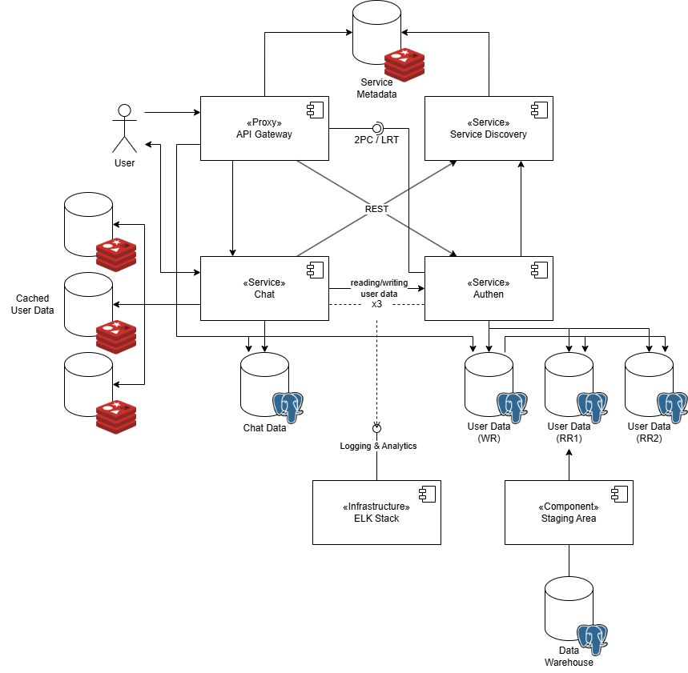

# Barber App

Documented design and implementation of a barber appointment app.

**In order to run the app**, have Docker installed on your machine and execute the following command:
```
docker compose up --build
```

## Architecture



- **AuthenService** - user data handling (reading/writing)
- **ChatService** - async chats (Django Channels), requests Authen for user data (names in chats, etc.)
- **ServiceDiscovery** - registers instances of services (saves IPs in **ServiceMetadata**)
- **API Gateway** - infrastructure performing load balancing (rr), task/rate limiting and circuit breaking

\* All the data exchanged is in JSON format.

## Tasks

### 1

Cogito, ergo sum.

### 2.

**AuthenService** - manages user records, main endpoints:

1. /authen/signup (authenService/authen/views.py - SignUpView):
    
        Expects: new user's username, password, first_name, last_name, type={'customer', 'employee'} (body)
        Returns: confirmation message

    For creating a new account.

2. /authen/signin (authenService/authen/views.py - SignInView):

        Expects: existing user's username, password (body)
        Returns: existing user's id (to be used for auth.)

    For 'logging' into an existing account.

3. /list/employee (authenService/users/views.py - EmployeeListView):

        Expects: nothing
        Returns: a list of users of 'employee' type

    Used by customers to discover barbers.

4. /utilities/check?user_id= (authenService/users/views.py - CheckUserIdView):

        Expects: user_id (query param)
        Returns: basic user data

    **Used by ChatService to check credentials (user_id-s provided) and retrieve their basic info** (since it has no direct access to the DB with user data).

**ChatService** - manages chats and communications within those chats:

1. /chats/start?employee_id= (chatService/chats/views.py - StartChatView):

        Expects: user_id ('X-User' header - auth.) and employee_id (query param)
        Returns: ws connection string (ws://.../chat/<std:identifier>)

    Creates a new chat between customer#user_id and barber#employee_id, the string returned can be used as url for ws connection (**the PORT specified in the url is taken from environmental variables**).

2. /chats/list/my (chatService/chats/views.py - ChatListMyView):

        Expects: user_id ('X-User' header - auth.)
        Returns: a list of user's chats

    Used to discover existing chats.

3. /chats/connect?id= (chatService/chats/views.py - ChatConnectView):

        Expects: existing chat's id (query param)
        Returns: ws connection string (ws://.../chat/<std:identifier>)

    Provides a ws connection string for the chat specified.

4. ws://.../chat/\<std:identifier\> (chatService/chats/consumers.py):

    AsyncJsonWebsocketConsumer handling async chat communications. On connection **checks user's auth. credentials ('X-User')**, retrieves his f- and lname to be attached to user's messages and also checks if user connecting is registered in the chat (preventing unauthorized access). For chatting send messages in the following format:

        {
            "type": "chat_message",
            "message": "Wazzup Beijing!"
        }

### 3.

1. Status enpoints: /utilities/views.py - StatusView

2. Timeouts:

    Timeouts are implemented on the gateway level:

    ```JavaScript
    app.all('/chat/*', async (req, res) => {
        ...
        try {
            ...
            const response = await axios({
                method: req.method,
                url: url,
                data: req.body,
                headers: req.headers,
                timeout: TIMEOUT_MS
            });
            ...
        } catch (error) {
            ...
            if (error.code === 'ECONNABORTED') {
                if (ip) await handleCircuitBreaker('chat', ip);
                res.status(504).send({ detail: `Request passed to ${ip} has timed out.` });
            }
            ...
        } finally {
            ...
        }
    });
    ```

    You can adjust it by changing `TIMEOUT_MS` env. var. in the docker-compose.api-gateway.

### 4.

1. From the architecture diagram one can see that each service has its own DB. Can also look at configurations in Docker.

2. The concurrent task limit is also implemented at the gateway level (which is difficult to do in Django without adding a message broker and Celery — bruh). You can adjust this setting by changing the TASK_LIMIT_PER_SERVICE environment variable in docker-compose.api-gateway. Essentially, after selecting an IP to forward a request to, it checks Redis for the value going by the key - 'tasks:\${IP}'. If this value is less than or equal to TASK_LIMIT_PER_SERVICE, it is incremented and the req. is forwarded (decrementing the value after receiving a response). If the value exceeds the limit, the gateway discards the request with a 503 status.

    ```JavaScript
    async function limitTasks(serviceType, ip) {
        const taskKey = `tasks:${ip}`;
        const currentTasks = await redisClient.get(taskKey);

        if (currentTasks && parseInt(currentTasks) >= MAX_TASKS) {
            throw new Error('Task limit reached');
        }

        await redisClient.incr(taskKey);
        return taskKey;
    }
    ```

**To test this**, call Sleepy 1, Sleepy 2, Sleepy 3, and Status requests simultaneously in Postman. For the Status request, you should receive a message indicating that the instance of authenService that processed Sleepy 1 is too busy to handle another request. You may need to increase the TIMEOUT_MS environment variable to 9000 and reduce TASK_LIMIT_PER_SERVICE to 1 in docker-compose.api-gateway.

### 5.

1. API Gateway is implemented in Express and its main functionality is to pass requests to service specified in urls: /authen/* for authenService and /chat/* for chatService.

    ```JavaScript
    app.all('...', async (req, res) => {
        try {
            ...
            const url = `http://${ip}:${SERVICE_REST_PORT}/${enpoint}`;
            const response = await axios({
                method: req.method,
                url: url,
                data: req.body,
                headers: req.headers,
                timeout: TIMEOUT_MS
            });

            res.status(response.status).send(response.data);
        } catch (error) {
            ...
        } finally {
            ...
        }
    });
    ```

2. Above I've described how chatService retrieves some info about users for auth. purposes. It happens in **CheckUserWithAuthenService permission** (chatService/chatService/permissions.py) and since its an interservice request for some unchanging data we can safely cache it for later use (implemented in **chatService.permissions.get_user_info** & **chatService.permissions.cache_user_info**). The cache I use is - **django.core.cache**.

    ```Python
    def get_user_info(user_id):

        # Check the cache first
        cached_user_data = cache.get(f"user_{user_id}_data")
        if cached_user_data:
            print(f"CheckUserWithAuthenService: Using cached data for user#{user_id}")
            return cached_user_data

        try:
            # Make request to authenService to check user's existence and get fname and lname
            ...
        except requests.RequestException as e:
            ...

        return None

    def cache_user_info(user_id, user_data):
        cache.set(f"user_{user_id}_data", user_data, timeout=3600)
        print(f"CheckUserWithAuthenService: Cached data for user#{user_id}")
    ```

    So when accessing, for example, /chats/list/my consecutively, you will find the following in the Docker logs:
    
        chat-service-2     | CheckUserWithAuthenService: Cached data for user#
        ...
        chat-service-2     | CheckUserWithAuthenService: Using cached data for user#2

### 6.

1. Serice Discovery is another application in Express. It has just one route that receives requests sent by services on their startup (register_service.py called from entrypoint.sh). In the body of the request services provide their type and ip (Docker network ip). SD appends the ip to the list saved in the Redis by the key - 'services:${type}'. You may see some logs when services are registered.

    ```JavaScript
    app.post('/register', async (req, res) => {
        const { host, type } = req.body;

        if (!host || !type) {
            return res.status(400).json({ detail: 'Host and service type are required.' });
        }

        try {
            const key = `services:${type}`;
            // Add the host to the array if it doesn't already exist
            await redisClient.lPushX(key, host);
            
            // In case the list does not exist, ensure to create it with lPush
            const listExists = await redisClient.exists(key);
            if (!listExists) {
                await redisClient.lPush(key, host);
            }

            res.status(200).json({ message: `Service registered: ${host} as ${type}` });
        } catch (err) {
            ...
        }
    });
    ```

2. Status endpoints for Gateway and SD: ...

### 7.

1. Round Robin LB. In the revious item I've mentioned how service discovery saves all ips it receives in lists. API Gateway iterates over those, while aquiring an ip to pass a request to, to distribute the load evenly.

    ```JavaScript
    let rrIndexAuth = 0;
    let rrIndexChat = 0;

    async function getNextIp(serviceType) {
        const key = `services:${serviceType}`;
        const ips = await redisClient.lRange(key, 0, -1);

        if (!ips || ips.length === 0) {
            throw new Error(`No available ${serviceType} instances`);
        }

        let nextIp;
        if (serviceType === 'authen') {
            nextIp = ips[rrIndexAuth % ips.length];
            rrIndexAuth++;
        } else if (serviceType === 'chat') {
            nextIp = ips[rrIndexChat % ips.length];
            rrIndexChat++;
        }

        return nextIp;
    }
    ```

    **To test**, just spam Status request in Postman and you shall receive responses from different services.

2. Circuit Breaker: When a request to a service times out, the gateway increments a counter in Redis using the key 'circuit:${ip}'. If this value does not exist, it is created with a value of 1 and an expiration period of TIMEOUT_MS * 4. If the value does exist, it is simply incremented. If the counter exceeds MAX_TIMEOUTS, the gateway logs a warning.

    ```JavaScript
    async function handleCircuitBreaker(serviceType, ip) {
        const breakerKey = `circuit:${ip}`;

        // Check the current failure count
        const currentFailures = await redisClient.get(breakerKey);

        // If the current failure count is null, set it to 1 and define the expiration
        if (currentFailures === null) {
            await redisClient.set(breakerKey, 1, 'EX', TIMEOUT_MS * 4); // Set failures to 1 and expire after TIMEOUT_MS * 4
        } else {
            await redisClient.incr(breakerKey); // Increment if already set
        }

        // Check if the current failures exceed the threshold
        if (currentFailures && parseInt(currentFailures) + 1 >= MAX_TIMOUTS) {
            console.log(`WARNING: ${ip} has failed to respond in adequate time ${currentFailures + 1} times within ${TIMEOUT_MS * MAX_TIMOUTS} ms`);
        }
    }
    ```

    To test it, just spam Sleepy 1, Sleepy 2, and Sleepy 3 simultaneously until you see alerts in the DOCKER logs:

        api-gateway        | Error on /authen: timeout of 6000ms exceeded
        api-gateway        | ALERT: 172.18.0.9 has failed to respond in adequate time 3 times within 18000 ms
        ...
        api-gateway        | Error on /authen: timeout of 6000ms exceeded
        api-gateway        | ALERT: 172.18.0.10 has failed to respond in adequate time 3 times within 18000 ms
        ...
        api-gateway        | Error on /authen: timeout of 6000ms exceeded
        api-gateway        | ALERT: 172.18.0.8 has failed to respond in adequate time 3 times within 18000 ms

### 8.

Test are written for the authenService to run them:

1. Activate the venv and install all the dependencies (authenService/requirements.txt).
2. Run python manage.py test app_name (app_name={'users', 'authen}) from the root of Django project.

\* You can find the code for tests in the test.py files.

### 9.

1. gRPC. Is not done.

2. Health Monitoring: As previously mentioned, the gateway tracks concurrent tasks. Load information is recorded in a similar manner; however, it is not decremented when the service responds. Instead, the load value is set to expire after one second. If the load for a service exceeds LOAD_THRESHOLD_PER_S_PER_SERVICE, an alert will be logged.

    ```JavaScript
    async function alertOnLoad(serviceType, ip) {
        const loadKey = `load:${ip}`;

        // Check the current load count
        const currentLoad = await redisClient.get(loadKey);

        // If the current load is 0, set it to 1 and define the expiration
        if (currentLoad === null) {
            await redisClient.set(loadKey, 1, 'EX', 1); // Set load to 1 and expire after 1 second
        } else {
            await redisClient.incr(loadKey); // Increment if already set
        }

        // Check if the current load exceeds the threshold
        if (currentLoad && parseInt(currentLoad) >= LOAD_THRESHOLD_PER_S_PER_SERVICE) {
            console.log(`ALERT: Load on ${serviceType} [${ip}] has exceeded ${LOAD_THRESHOLD_PER_S_PER_SERVICE} req/s`);
        }
    }
    ```

        api-gateway        | ALERT: Load on authen [172.18.0.9] has exceeded 4 req/s
        authen-service-1   | 172.18.0.6 - - [24/Oct/2024:16:31:16 +0000] "GET /utilities/status HTTP/1.1" 202 79 "-" "PostmanRuntime/7.42.0"
        api-gateway        | ALERT: Load on authen [172.18.0.10] has exceeded 4 req/s
        authen-service-3   | 172.18.0.6 - - [24/Oct/2024:16:31:17 +0000] "GET /utilities/status HTTP/1.1" 202 79 "-" "PostmanRuntime/7.42.0"
        api-gateway        | ALERT: Load on authen [172.18.0.8] has exceeded 4 req/s
        authen-service-2   | 172.18.0.6 - - [24/Oct/2024:16:31:18 +0000] "GET /utilities/status HTTP/1.1" 202 79 "-" "PostmanRuntime/7.42.0"
        api-gateway        | ALERT: Load on authen [172.18.0.9] has exceeded 4 req/s
        authen-service-1   | 172.18.0.6 - - [24/Oct/2024:16:31:19 +0000] "GET /utilities/status HTTP/1.1" 202 79 "-" "PostmanRuntime/7.42.0"
        api-gateway        | ALERT: Load on authen [172.18.0.10] has exceeded 4 req/s
        authen-service-3   | 172.18.0.6 - - [24/Oct/2024:16:31:20 +0000] "GET /utilities/status HTTP/1.1" 202 79 "-" "PostmanRuntime/7.42.0"

### 10.

1. Is not done.

2. Is not done.